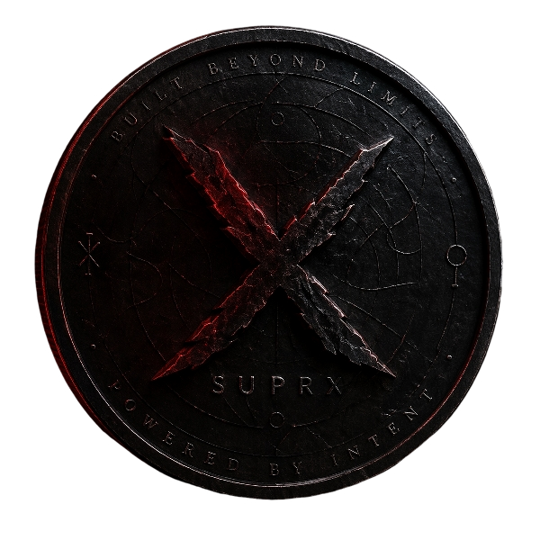

# SUPRX



Official user-facing front page for the current SUPRX Windows wallet release.

## Download

- [Download the latest Windows wallet ZIP](downloads/suprx-win64.zip)
- [SHA256 checksums](SHA256SUMS.txt)
- [Main site](https://suprx.supermoms.info/)
- [Proof page](https://suprx.supermoms.info/proof.html)
- [Explorer](https://api.suprx.supermoms.info/explorer/)
- Support: `suprx@supermoms.info`

## Current Windows Release

- File: `suprx-win64.zip`
- Built package date: `April 22, 2026`
- Size: `67,916,173 bytes`
- SHA256: `00c304a1fce64e49396f844fbac617810aec7f558c18767959b43ca34b3dd9ef`

## What Is Inside

The ZIP includes the full Windows desktop package:

- `suprx-qt.exe` - main desktop wallet UI
- `suprx-wallet.exe` - wallet tool
- `suprxd.exe` - node daemon
- `suprx-cli.exe` - command line client
- `suprx-tx.exe` - transaction tool
- `suprx-util.exe` - utility tool
- `vc_redist.x64.exe` - Microsoft runtime installer
- `export_mobile_recovery_easy.bat` - helper to export wallet recovery data for a future mobile import

## Quick Start

1. Download `suprx-win64.zip`.
2. Unzip it to a normal folder such as `C:\SUPRX`.
3. If Windows asks for missing runtime files, run `vc_redist.x64.exe`.
4. Open `suprx-qt.exe`.
5. Let the wallet sync before expecting current balances or recent transactions.

## Verify The Download

On Windows PowerShell:

```powershell
Get-FileHash .\suprx-win64.zip -Algorithm SHA256
```

The hash should match:

```text
00c304a1fce64e49396f844fbac617810aec7f558c18767959b43ca34b3dd9ef
```

`SHA256SUMS.txt` also includes the checksums for `suprx-qt.exe`, `suprxd.exe`, `suprx-cli.exe`, `suprx-tx.exe`, `suprx-wallet.exe`, and `suprx-util.exe`.

## Important Safety Notes

- This repo is meant to contain only public release files and public docs.
- It should **never** contain `wallet.dat`, private keys, mobile recovery exports, `.env` files, or node data.
- Anyone who gets wallet recovery exports can take the coins.
- Do not share files created by `export_mobile_recovery_easy.bat`.

## How SUPRX Fits Together

- `SUPRX` is the native SHA256d chain coin.
- `wSUPRX` is the Base-side wrapped token used for trading and ecosystem utility.
- Public reserve proof is here: [api.suprx.supermoms.info/api/proof](https://api.suprx.supermoms.info/api/proof)

## More Project Links

- [About SUPRX](https://suprx.supermoms.info/about.html)
- [Tokenomics](https://suprx.supermoms.info/tokenomics.html)
- [Litepaper](https://suprx.supermoms.info/litepaper.html)
- [Builder Bounties](https://suprx.supermoms.info/bounties.html)
